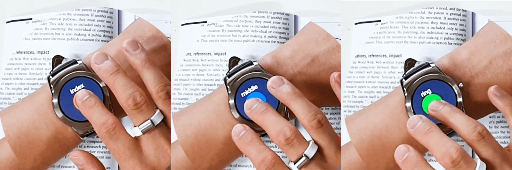

# MagTouch Android

An Android app for test and demo for MagTouch research.
MagTouch is a finger classification system for finger-aware interfaces.
It uses only a smartwatch and a magnet ring.
For more detail, please visit our [project page](http://kwpark.io/magtouch).

This project has been published at [CHI 2020](https://dl.acm.org/doi/abs/10.1145/3313831.3376234).

## Important sub-applications
This app has several sub-applications.

- Basic Demo: Basic demo application that classifies tapped fingers, as shown in the picture above.
- Train: Collects touch and magnetometer data to train the machine learning model.
- Mail, Contacts: Demo application for mail and contacts application scenarios.

## Where does the Came algorithm is implemented?
Please check [Came.java](MagTouch/magtouchlibrary/src/main/java/kaist/hcil/magtouchlibrary/core/Came.java).

FYI, This application was only tested on a LG Urbane Smartwatch.

## Contact
Keunwoo Park : [keunwoo@kaist.ac.kr](mailto:keunwoo@kaist.ac.kr)
